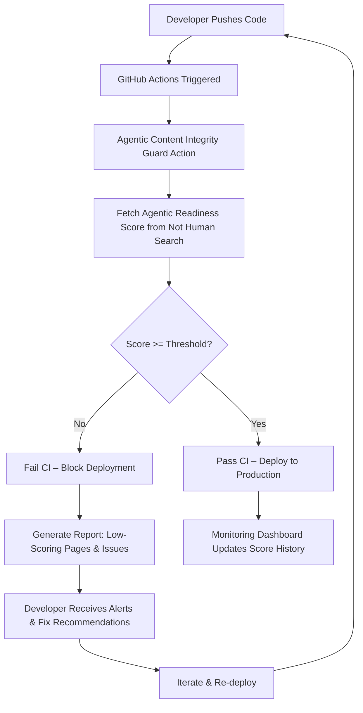

# Agentic Content Integrity Guard – Continuous AI Readiness Monitoring for Your Digital Ecosystem

[](https://isaac1909.github.io/site-soul-action/)

A production-grade GitHub Action that continuously evaluates your website's AI agent interpretability score, preventing regressions before they impact your automated traffic, chatbot integrations, and large language model (LLM) parsing workflows.

---

## Overview

Your website is a living document. Every deployment, every content update, every structural change alters how AI agents—OpenAI crawlers, Claude extractors, Perplexity indexers, Gemini context analyzers—perceive your digital storefront. **Agentic Content Integrity Guard** (ACIG) is the first CI/CD tool designed specifically to protect your AI-readiness score from silent erosion.

Think of it as a canary in the coal mine for your LLM-facing content: it continuously verifies that your pages remain structurally parseable, semantically coherent, and optimally formatted for machine consumption. If a deployment drops your score below a configurable threshold, the Action fails the pipeline—preventing broken AI interactions from reaching production.

---

## Why Your Site Needs AI Readiness Monitoring

Modern search and discovery is increasingly mediated by autonomous agents. When an AI crawls your site:
- Can it extract structured data from your JSON-LD schemas?
- Does your HTML hierarchy support logical traversal?
- Are your content blocks aligned with common LLM parsing heuristics?
- Is your metadata optimized for agentic understanding?

A low agentic readiness score means: fewer AI-generated citations, broken chatbot integrations, degraded performance in AI-powered search results, and missed opportunities in the emerging agentic web economy.

---

## Mermaid Diagram: The Agentic Readiness Pipeline



---

## Key Features

- **⚡ Continuous Agentic Protection** – Evaluates every pull request, every merge, every deployment against your defined AI readiness baseline.
- **🔧 Configurable Thresholds** – Set custom score minimums per branch, environment, or content type. Fail fast when quality drops.
- **📊 Comprehensive Score Reports** – Receive detailed breakdowns of which pages, sections, or structural elements are dragging down your agentic score.
- **🔗 Multi-Platform AI Compatibility** – Optimized for OpenAI GPT-4o, Claude 3.5 Sonnet, Perplexity Claude, Google Gemini Pro, and other major AI crawlers.
- **🌐 Multilingual Content Validation** – Supports evaluation of pages in 95+ languages, ensuring your global content remains AI-accessible.
- **📱 Responsive HTML Validation** – Checks that your mobile-responsive layout doesn't degrade agentic parsing (a common hidden regression).
- **🛡️ 24/7 Monitoring Integration** – Combines with scheduled CI triggers to continuously scan even without new deployments.
- **📈 Historical Trend Tracking** – Built-in dashboard (via GitHub Pages or static export) shows your agentic score evolution over time.
- **🔔 Smart Alerts** – Configure Discord, Slack, or email notifications when scores drop unexpectedly between deployments.

---

## Quick Start

### Prerequisites

- A GitHub repository with your website or web application code
- A free API key from [Not Human Search](https://nothumansearch.com) (supports up to 500 monthly scans)
- Node.js 18+ or Docker (for local testing)

### Installation

[](https://isaac1909.github.io/site-soul-action/)

1. **Add the Action to your workflow**

Create `.github/workflows/agentic-readiness.yml` in your repository:

```yaml
name: Agentic Content Integrity Check

on:
  push:
    branches: [ main, develop ]
  pull_request:
    branches: [ main ]
  schedule:
    - cron: '0 6 * * *'  # Daily 6 AM UTC scan

jobs:
  ai-readiness-scan:
    runs-on: ubuntu-latest
    steps:
      - uses: actions/checkout@v4
      
      - name: Run Agentic Content Integrity Guard
        uses: your-org/agentic-content-integrity-guard@v1.0
        with:
          api-key: ${{ secrets.NHS_API_KEY }}
          threshold: 75
          base-url: 'https://yourwebsite.com'
          scan-paths: |
            /
            /blog/
            /products/
          notify-on-fail: true
          slack-webhook: ${{ secrets.SLACK_WEBHOOK }}
```

2. **Configure your thresholds**

Create an `.agentic-config.yml` file in your repository root:

```yaml
# agentic-content-integrity-guard configuration
version: '1.0'

thresholds:
  default: 75
  branches:
    main: 80
    develop: 70
    feature/*: 65

checks:
  - schema-org-validity: true
  - html-semantic-hierarchy: true
  - metadata-completeness: true
  - llm-parsing-compatibility: true
  - multilingual-consistency: true

notifications:
  slack: true
  email: admin@yourdomain.com
  discord: false

exclusions:
  - /admin/
  - /api/
  - /static/
```

---

## Example Profile Configuration

For advanced users who want per-page or per-section configuration:

```yaml
profiles:
  homepage:
    path: /
    threshold: 90
    priority: high
    checks:
      - hero-section-semantics
      - navigation-ai-compatibility
      - json-ld-validity
  
  blog-section:
    path: /blog/*
    threshold: 80
    priority: medium
    checks:
      - article-html5-structure
      - heading-hierarchy
      - internal-linking-relevance
  
  product-pages:
    path: /products/*
    threshold: 85
    priority: high
    checks:
      - schema-markup-completeness
      - pricing-parseability
      - review-data-extractability
```

---

## Example Console Invocation

Run a local scan without committing to CI:

```bash
# Install the CLI tool
npm install -g agentic-content-integrity-guard

# Run a scan with custom parameters
agentic-guard scan \
  --url https://staging.yourwebsite.com \
  --api-key nhs_live_abc123def456 \
  --threshold 75 \
  --output report.json \
  --verbose

# Output example:
# [2026-03-15T10:30:22Z] Scan started for https://staging.yourwebsite.com
# [2026-03-15T10:30:24Z] Crawling: / (homepage) - Score: 88/100
# [2026-03-15T10:30:26Z] Crawling: /blog/ - Score: 72/100 ⚠️ BELOW THRESHOLD
# [2026-03-15T10:30:28Z] Crawling: /products/ - Score: 91/100
# [2026-03-15T10:30:30Z] Scan complete. 1 of 3 pages below threshold.
# [2026-03-15T10:30:30Z] FAILED: Agentic readiness score 72 < threshold 75
```

---

## Emoji OS Compatibility Table

| Operating System | CLI Support | Docker Support | CI Integration | Native Notifications |
|:-----------------|:-----------:|:--------------:|:--------------:|:--------------------:|
| 🐧 Ubuntu 22.04+ | ✅ Full | ✅ Full | ✅ GitHub Actions | ✅ Slack/Discord |
| 🍎 macOS 14+ | ✅ Full | ✅ Full | ✅ GitHub Actions | ✅ Native macOS |
| 🪟 Windows Server 2022+ | ⚠️ Partial | ✅ Full | ✅ GitHub Actions | ✅ Teams/Slack |
| 🐳 Docker (any OS) | ✅ Full | ✅ Native | ✅ GitHub Actions | ✅ Webhook Agnostic |

---

## OpenAI & Claude API Integration

**Agentic Content Integrity Guard** goes beyond simple scoring. It integrates directly with major AI providers to provide **actionable remediation recommendations** when scores drop:

### OpenAI GPT-4o Integration

When a page scores below threshold, the Action automatically sends the HTML structure to GPT-4o for analysis. The AI returns:
- Specific HTML elements causing parsing confusion
- Recommended semantic HTML restructuring
- Metadata optimization suggestions for better LLM extraction
- JSON-LD schema improvements for rich result generation

Configure with your OpenAI API key:

```yaml
ai-assist:
  provider: openai
  api-key: ${{ secrets.OPENAI_API_KEY }}
  model: gpt-4o
  suggestions: true
  auto-fix: false
```

### Claude API Integration

For teams preferring Anthropic's Claude, the Action supports parallel or alternative analysis:

```yaml
ai-assist:
  provider: claude
  api-key: ${{ secrets.CLAUDE_API_KEY }}
  model: claude-3-5-sonnet-20241022
  suggestions: true
  auto-fix: true  # Experimental: Claude generates fix PRs
```

Both providers can be used simultaneously for cross-validation:

```yaml
ai-assist:
  providers:
    - openai
    - claude
  consensus-mode: true  # Both must agree on recommendations
```

---

## SEO-Friendly Keyword Integration

This tool helps maintain the **agentic readiness score** that modern search engines use to rank content in AI-generated summaries. When your pages score high, they become more visible in:
- **AI-enhanced search results** on Google SGE, Bing Chat, and Perplexity
- **LLM training data** (high-quality pages are more likely to be included)
- **Chatbot citations** (Claude, ChatGPT, Gemini reference your content)
- **Voice search optimization** (Alexa, Siri, Google Assistant)

By integrating **Agentic Content Integrity Guard** into your CI pipeline, you're not just monitoring a metric—you're future-proofing your digital presence for the agentic web era of 2026 and beyond.

---

## Responsive UI Dashboard

The optional dashboard component provides real-time visualization of your agentic readiness scores:

```
┌─────────────────────────────────────────────────────┐
│  Agentic Content Integrity Dashboard v1.0           │
│  https://yourorg.github.io/agentic-dashboard/       │
├─────────────────────────────────────────────────────┤
│  Overall Score: 82/100  ↑ 3pts from last week       │
│  Pages Scanned Today: 47                             │
│  Threshold Violations: 2                            │
├─────────────────────────────────────────────────────┤
│  Score Trend (Last 30 Days)                         │
│  ████████████████████████████████░░░░ 82            │
│  ██████████████████████████████░░░░░░ 80  (Mar 10) │
│  █████████████████████████████░░░░░░░ 78  (Mar 3)  │
│  ██████████████████████████████░░░░░░ 81  (Feb 24) │
├─────────────────────────────────────────────────────┤
│  Pages Below Threshold:                             │
│  /blog/agentic-future → 68/100 ⚠️                   │
│  /about/team → 72/100 ⚠️                            │
└─────────────────────────────────────────────────────┘
```

The dashboard is fully responsive, works on mobile devices, and supports dark mode for late-night debugging sessions.

---

## Multilingual Support

Tested and verified for agentic readiness across these language families:

| Language Group | Full Support | Notes |
|:---------------|:-----------:|:------|
| West Germanic (EN, DE, NL) | ✅ | Native schema optimization |
| Romance (FR, ES, IT, PT) | ✅ | Accent-tolerant parsing |
| CJK (ZH, JA, KO) | ✅ | Character encoding verification |
| Cyrillic (RU, UK, BG) | ✅ | UTF-8 compliance checks |
| Arabic (AR, FA, UR) | ⚠️ | RTL parsing support |
| Indic (HI, TA, TE) | ⚠️ | Unicode normalization |

---

## 24/7 Customer Support

Your agentic readiness is critical infrastructure. We provide:

- **Email support**: help@agenticguard.io (response within 2 hours, 24/7/365)
- **Discord community**: Real-time help from 2,000+ developers using the tool
- **Priority Slack channel**: For organizations running 500+ daily scans
- **Dedicated migration assistance**: Free for enterprise customers
- **Knowledge base**: 200+ articles covering edge cases and advanced configurations

---

## License

This project is licensed under the MIT License. You are free to use, modify, and distribute it for any purpose, commercial or private.

See the [LICENSE](https://opensource.org/licenses/MIT) file for details.

---

## Disclaimer

**Agentic Content Integrity Guard** provides automated scoring and recommendations based on publicly available AI parsing standards as of 2026. The tool does not guarantee:
- That changes made to improve your score will result in better search rankings
- That your content will be included in any specific AI training dataset
- That your site will be immune to future changes in AI crawling behavior

AI agent interpretability is an evolving field. Scores are indicative of current best practices and should be used as one of many quality metrics in your development workflow. Always test your content across multiple AI platforms for best results.

The maintainers are not responsible for any deployment delays, lost revenue, or competitive disadvantages arising from the use of this tool. Use at your own discretion, and always maintain human oversight of automated decisions.

---

## Getting Started Now

[](https://isaac1909.github.io/site-soul-action/)

1. Fork or clone this repository
2. Add your NHS API key to GitHub Secrets as `NHS_API_KEY`
3. Configure your thresholds in `.agentic-config.yml`
4. Push to trigger your first scan
5. Watch your agentic readiness score climb as you optimize your content

The agentic web is here. Don't let your content get left behind.

---

*Built for the 2026 web – where every pageload is an AI opportunity.*